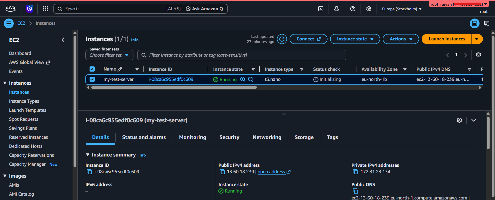
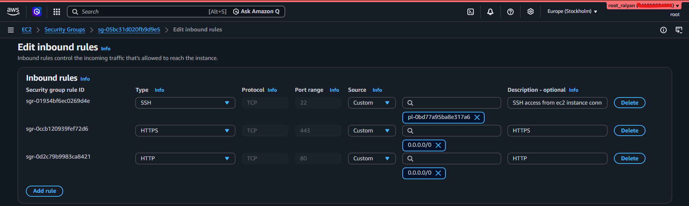
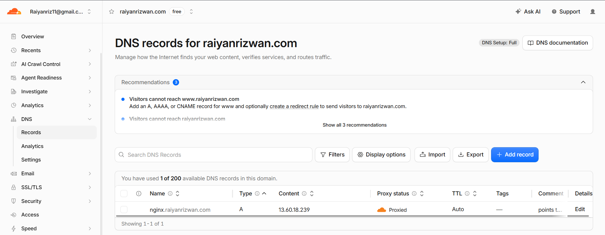
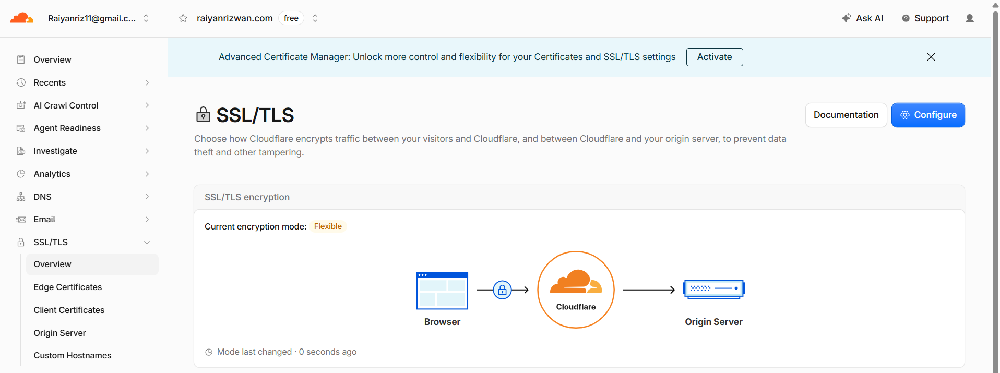
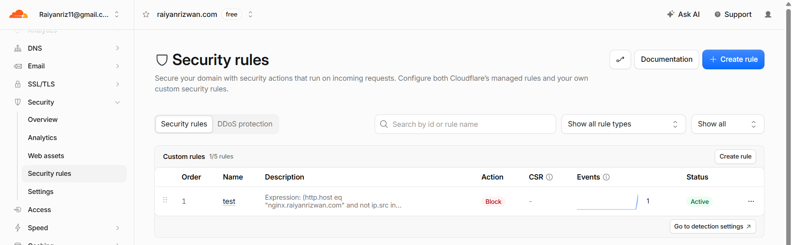
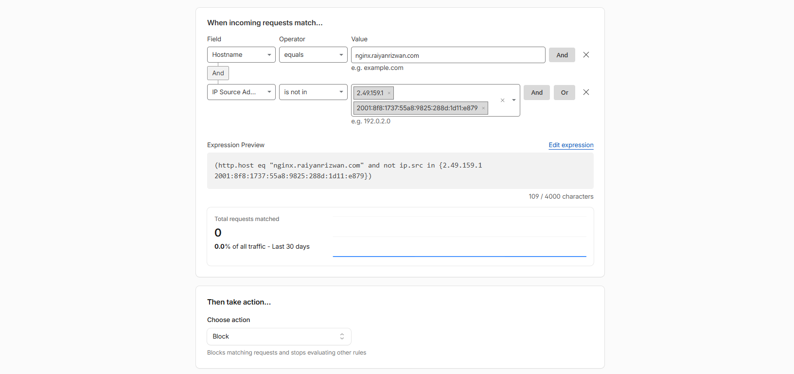
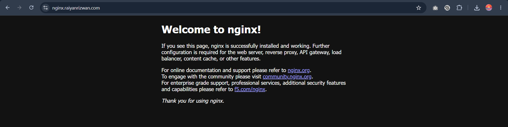

### Objective

Deploy Nginx on EC2, expose it through a Cloudflare-proxied subdomain, and explore network and visitor access restrictions.

### EC2 and Nginx



Launched an EC2 instance in `eu-north-1` and installed Nginx:

```
sudo yum install -y nginx
sudo systemctl enable nginx
sudo systemctl start nginx
```

Verified that Nginx was running and serving HTTP:

```
sudo systemctl status nginx --no-pager
sudo nginx -t
curl -I http://127.0.0.1
sudo ss -lntp | grep ':80'
```

The local request returned `200 OK`, and Nginx listened on port 80.

### Security group



| Port | Allowed source                                  | Purpose                                                            |
| ---- | ----------------------------------------------- | ------------------------------------------------------------------ |
| 22   | `com.amazonaws.eu-north-1.ec2-instance-connect` | AWS Console browser SSH over IPv4                                  |
| 80   | `0.0.0.0/0`                                     | Public HTTP access                                                 |
| 443  | `0.0.0.0/0`                                     | Permits HTTPS connections, but Nginx still needs TLS configuration |

I initially selected the IPv6 Instance Connect prefix list. Replacing it with the IPv4 list resolved that configuration mismatch.

For this test, I left web access open. This means the Cloudflare visitor restrictions can be bypassed through direct HTTP access to the EC2 IP. Restricting the origin’s web ports to [Cloudflare’s IP ranges](https://www.cloudflare.com/ips/) would close that direct path.

### Cloudflare DNS and encryption



Created a **proxied A record** for `nginx.raiyanrizwan.com`, pointing to the EC2 public IPv4 address.

The hostname initially failed because Nginx served HTTP only, while Cloudflare’s Full mode attempted HTTPS to the origin.



For HTTPS visitors:

```
Flexible:      Browser → HTTPS → Cloudflare → HTTP  → Nginx
Full:          Browser → HTTPS → Cloudflare → HTTPS → Nginx
Full (strict): Same encrypted path, plus origin certificate validation
```

I switched to Flexible for this exercise. The next improvement is to install an origin certificate, configure Nginx on port 443, and switch to Full (strict).

### Restricting visitors



Created a Cloudflare custom rule that blocks requests to this hostname unless the visitor’s source IP matches my IPv4 or IPv6 address.

Allowing only my IPv4 address could block my own browser when it connected over IPv6. These addresses can change, so the rule may need updating.

### Key learning



**EC2 sees Cloudflare’s source IP for proxied web traffic; Cloudflare sees the visitor’s source IP.** Restrictions must therefore be applied at the appropriate layer.
