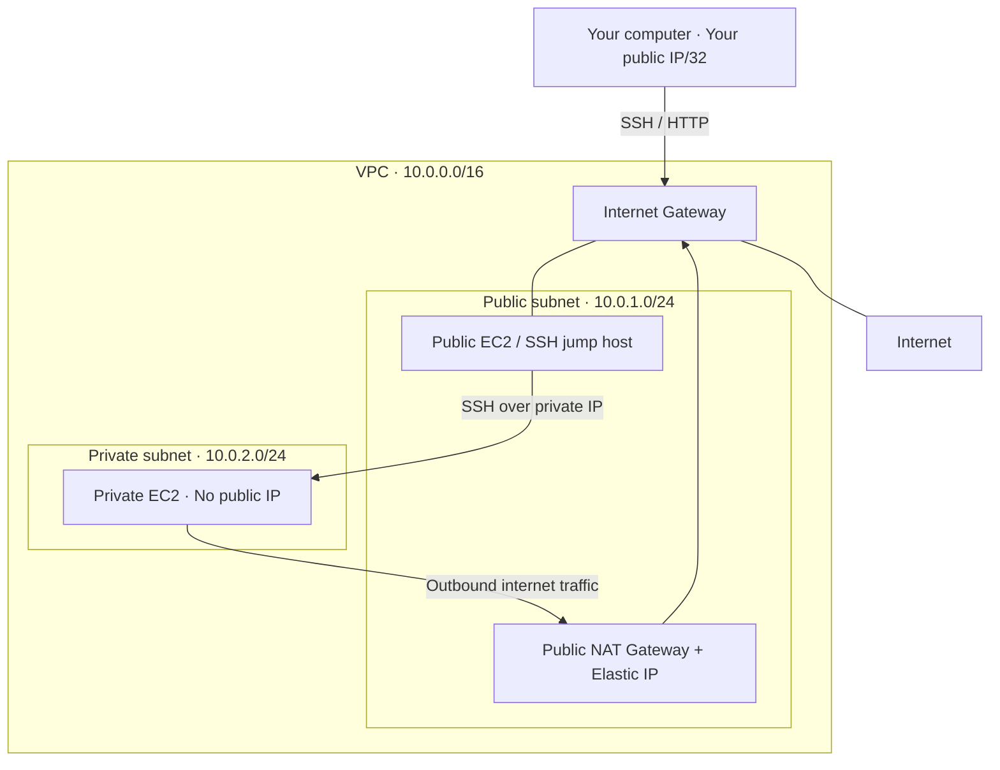

# Assignment 1 — VPC & Networking

## Objective

Build a custom VPC with one public subnet and one private subnet, configure internet routing, deploy an EC2 instance in each subnet, and demonstrate secure access. Start with an architecture diagram, then build, test, and document the setup.

Use one AWS Region and one Availability Zone for this introductory lab.

## Architecture plan

| Resource | Name | Configuration |
|---|---|---|
| VPC | `assignment-vpc` | `10.0.0.0/16` |
| Public subnet | `public-subnet` | `10.0.1.0/24` |
| Private subnet | `private-subnet` | `10.0.2.0/24` |
| Internet Gateway | `assignment-igw` | Attached to the VPC |
| Public NAT Gateway | `assignment-nat` | In the public subnet, with an Elastic IP |
| Public EC2 | `public-ec2` | Public IPv4 enabled |
| Private EC2 | `private-ec2` | No public IPv4 |



This diagram summarizes connectivity; route tables determine forwarding. The public subnet uses `0.0.0.0/0 → IGW`. The private subnet uses `0.0.0.0/0 → NAT Gateway`.

The NAT Gateway lets the private instance initiate internet connections, such as package downloads. It does not provide inbound SSH access. See [AWS routing guidance](https://docs.aws.amazon.com/vpc/latest/userguide/route-table-options.html).

## Build order

1. Create the VPC using **VPC only**, with IPv4 CIDR `10.0.0.0/16`. Enable DNS resolution and DNS hostnames.
2. Create both subnets in that VPC, using the planned ranges and the same Availability Zone.
3. Create an Internet Gateway and attach it to the VPC.
4. Create a public route table, add the default route to the Internet Gateway, and explicitly associate the public subnet.
5. Allocate an Elastic IP. Create a **public NAT Gateway in the public subnet**, assign that Elastic IP, and wait until the gateway is available.
6. Create a private route table, add the default route to the NAT Gateway, and explicitly associate the private subnet.

| Route table | Destination | Target |
|---|---|---|
| Public | `10.0.0.0/16` | `local` — automatically created |
| Public | `0.0.0.0/0` | Internet Gateway |
| Private | `10.0.0.0/16` | `local` — automatically created |
| Private | `0.0.0.0/0` | NAT Gateway |

Check subnet associations carefully. A subnet is public because of its route to an Internet Gateway, not its name. See [AWS subnet route tables](https://docs.aws.amazon.com/vpc/latest/userguide/subnet-route-tables.html).

## Security groups and EC2

Create both security groups in the custom VPC.

| Security group | Inbound rule | Source |
|---|---|---|
| `public-ec2-sg` | SSH / TCP 22 | Your current public IP `/32` |
| `public-ec2-sg` | HTTP / TCP 80 | Your current public IP `/32` |
| `private-ec2-sg` | SSH / TCP 22 | `public-ec2-sg` |

Keep the default outbound rules for this lab. Inbound restrictions do not prevent outbound package downloads. See [AWS security group guidance](https://docs.aws.amazon.com/AWSEC2/latest/UserGuide/creating-security-group.html).

Launch two Amazon Linux instances using a key pair you control:

- **Public EC2:** public subnet, auto-assigned public IPv4 enabled, `public-ec2-sg` attached.
- **Private EC2:** private subnet, auto-assigned public IPv4 disabled, `private-ec2-sg` attached.

The allocated Elastic IP belongs to the NAT Gateway. The public EC2 can use an automatically assigned public IP.

## Validation

| Test | Expected result |
|---|---|
| SSH from your computer to public EC2 | Successful |
| Open public EC2 HTTP page from your computer | Successful after installing the web server |
| SSH to private EC2 through public EC2 | Successful |
| Make an HTTPS request from private EC2 | Successful through NAT |
| Inspect private EC2 networking | No public IPv4 address |

### Public HTTP test

Run on the public EC2:

```bash
sudo dnf install -y httpd
echo "Assignment 1 - Public EC2 working" | sudo tee /var/www/html/index.html
sudo systemctl enable --now httpd
```

Visit `http://PUBLIC_IP` from your computer. Replace `PUBLIC_IP` with the instance's public IPv4 address.

### Private SSH and outbound internet test

The public instance can act as an SSH jump host. With the same key pair on both instances, run this on your computer, replacing the key path and IP placeholders:

```bash
ssh -i assignment-key.pem -o "IdentitiesOnly=yes" -o "ProxyCommand=ssh -i assignment-key.pem -o IdentitiesOnly=yes -W %h:%p ec2-user@PUBLIC_IP" ec2-user@PRIVATE_IP
```

This keeps the private key on your computer. Use the private instance's private address for `PRIVATE_IP`.

Once connected to the private instance:

```bash
hostname
ip -4 addr
curl -I https://aws.amazon.com
```

A successful HTTPS request demonstrates outbound connectivity from the private subnet.

## Submission and screenshot checklist

1. Objective and architecture diagram.
2. Resource table with Region, Availability Zone, names, and CIDRs.
3. Network screenshots: VPC, both subnets, attached Internet Gateway, and NAT Gateway showing its public subnet and Elastic IP.
4. Both route tables showing routes and subnet associations.
5. Both security groups showing inbound rules.
6. EC2 details showing subnet placement and public/private IP information.
7. Testing evidence: browser page, SSH access, and private instance HTTPS request.
8. Short explanation of public access, internal SSH access, and private outbound access through NAT.

Take screenshots after each component is configured, with resource names and relevant settings visible. Show both configuration and proof that it works. Never include the contents of your private key.

## Review of the supplied architecture diagram

The diagram is a good starting point: it places the NAT Gateway in the public subnet, separates the EC2 instances into public and private subnets, and includes an Internet Gateway and separate route tables.

Before submitting, make these changes:

1. **Add CIDRs and an Availability Zone label.** Label the VPC `10.0.0.0/16`, the public subnet `10.0.1.0/24`, and the private subnet `10.0.2.0/24`. Tiny address text inside route-table icons is insufficient to document the routes.
2. **Show actual route-table entries and associations.** Public: `10.0.0.0/16 → local`, `0.0.0.0/0 → IGW`. Private: `10.0.0.0/16 → local`, `0.0.0.0/0 → NAT`. Use dashed association lines to the respective subnets.
3. **Label the NAT Gateway's Elastic IP.** Label the public EC2 as having a public IPv4 address and the private EC2 as having no public IPv4 address.
4. **Add your computer and access rules.** Show SSH/HTTP from your public IP `/32` to the public EC2, and SSH from the public EC2 to the private EC2 over private addresses. Label the private security group's source as `public-ec2-sg`.
5. **Clarify the router icon.** AWS provides VPC routing; you do not create a separate router resource. Remove the icon for simplicity, or label it “AWS implicit VPC router.”
6. **Clarify the private outbound path.** Show `Private EC2 → NAT Gateway → Internet Gateway → Internet`. The current line begins in the private subnet without clearly identifying its source.
7. **Treat CloudWatch as optional.** A shared generic VPC endpoint is unnecessary for this assignment's basic EC2 monitoring. Remove it from the baseline diagram. If implementing a CloudWatch interface endpoint for agent/API traffic, identify the service and show its endpoint network interfaces in selected subnets. An endpoint is not required simply to enable EC2 monitoring.

Security group boxes are acceptable visual shorthand, but security groups attach to instance network interfaces rather than creating separate subnet boundaries. The public instance can serve as the lab's jump host; a dedicated bastion is optional.

For a clean submission, finish the core VPC architecture first and add any implemented monitoring features afterward.
