# Assignment 1: VPC and Networking

Build a custom VPC with public and private subnets, configure internet routing, and demonstrate secure access to EC2 instances.

**Region:** Europe (Stockholm), `eu-north-1`  
**Availability Zone:** `eu-north-1a`  
**Evidence date:** 3 October 2026

## Contents

- [Architecture](#architecture)
- [Resource inventory](#resource-inventory)
- [VPC and subnets](#vpc-and-subnets)
- [Internet access](#internet-access)
- [Route tables](#route-tables)
- [Security groups](#security-groups)
- [EC2 instances](#ec2-instances)
- [Connectivity tests](#connectivity-tests)
- [Troubleshooting and lessons learned](#troubleshooting-and-lessons-learned)
- [References](#references)

## Architecture

The public instance hosts a test web page and acts as an SSH jump host. The private instance has no public IPv4 address and uses NAT for outbound internet access.

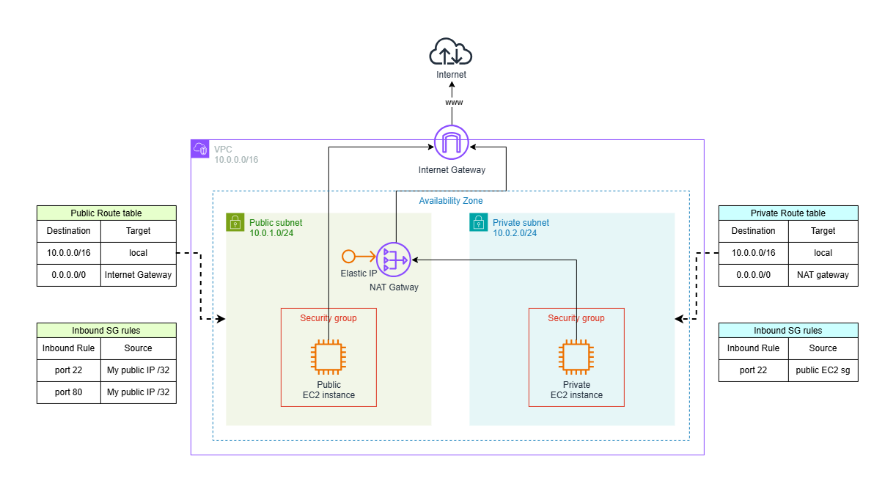

_The updated diagram uses `10.0.0.0/16` for local routes and ?My public IP /32? for SSH and HTTP. The public EC2 acts as a combined web server and bastion in `eu-north-1a`._

[Open the editable draw.io diagram](AWS-Assignment1.drawio)

## Resource inventory

All resources are in `eu-north-1`. IP addresses reflect the captured evidence and may change later.

| Resource                 | Name or identifier           | Availability Zone / scope                                      | CIDR or IP address                            |
| ------------------------ | ---------------------------- | -------------------------------------------------------------- | --------------------------------------------- |
| VPC                      | `my-test-vpc-01`             | Regional                                                       | `10.0.0.0/16`                                 |
| Public subnet            | `my-public-subnet-01`        | `eu-north-1a`                                                  | `10.0.1.0/24`                                 |
| Private subnet           | `my-private-subnet-01`       | `eu-north-1a`                                                  | `10.0.2.0/24`                                 |
| Internet Gateway         | `my-IGW`                     | VPC attachment                                                 | N/A                                           |
| NAT Gateway              | `nat-0cad1ae32b8356c55`      | Zonal, public subnet in `eu-north-1a` (reported configuration) | `13.63.104.74`                                |
| Elastic IP for zonal NAT | Previously unused allocation | Regional allocation                                            | `13.63.104.74`                                |
| Public route table       | `my-public-route-table-01`   | Public subnet association                                      | See routes below                              |
| Private route table      | `my-private-route-table-01`  | Private subnet association                                     | See routes below                              |
| Public EC2 / jump host   | `My Public EC2 VPCTST01`     | `eu-north-1a`                                                  | Private: `10.0.1.81`; public: `51.21.220.255` |
| Private EC2              | `My Private EC2 VPCTST01`    | `eu-north-1a`                                                  | Private: `10.0.2.32`; no public IP            |
| Public security group    | `public-ec2-sg`              | VPC                                                            | N/A                                           |
| Private security group   | `private-ec2-sg`             | VPC                                                            | N/A                                           |

## VPC and subnets

### VPC

The custom VPC uses `10.0.0.0/16`. DNS resolution is enabled; DNS hostnames are disabled in this screenshot.

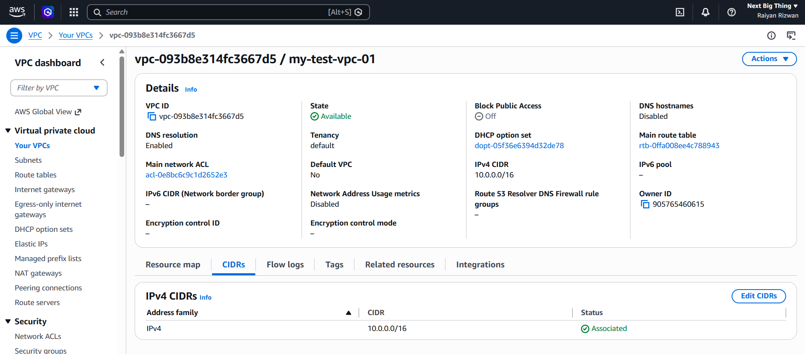

### Subnet overview

The two non-overlapping `/24` subnets fit within the VPC's `/16` range.

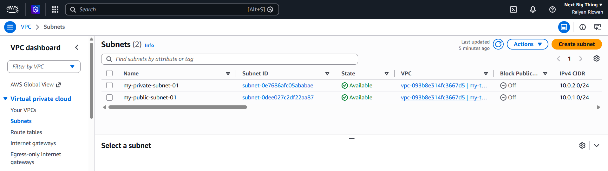

### Public subnet

`my-public-subnet-01` uses `10.0.1.0/24` in `eu-north-1a` and is associated with the public route table. Subnet-level auto-assignment of public IPv4 is **No** in this capture; the public EC2 screenshot later shows an auto-assigned address on the instance.

**Why these settings can differ:** The subnet setting is a default. When launching an instance, its **Auto-assign public IP** setting can override that default. A subnet default of **No** does not prevent an individual instance from receiving a public IP. Your working instance needs no correction solely because these settings differ; the launch-time selection itself is not captured here.

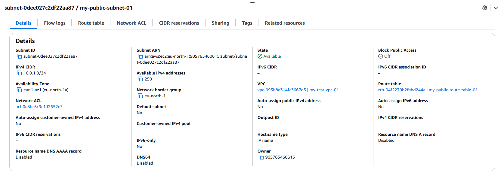

### Private subnet

`my-private-subnet-01` uses `10.0.2.0/24` in `eu-north-1a`. Public IPv4 auto-assignment is disabled.

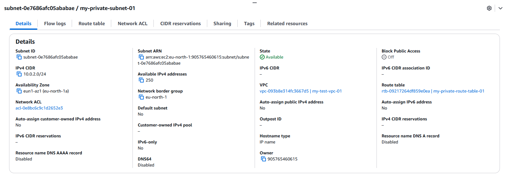

## Internet access

### Internet Gateway

`my-IGW` is attached to `my-test-vpc-01`.

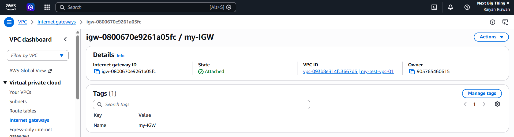

### NAT Gateway

I initially created a Regional NAT Gateway, then created a replacement **Zonal NAT Gateway** in the public subnet to match the assignment. The replacement ID is `nat-0cad1ae32b8356c55`.

The new private-route screenshot below confirms that the default route targets this replacement and is **Active**. Zonal mode and subnet placement are recorded from my implementation notes; a replacement gateway details screenshot is not included.

### Elastic IP

I had two Elastic IPs: `13.63.16.100` was used by the original Regional NAT Gateway, and `13.63.104.74` was unused. I reused `13.63.104.74` for the replacement Zonal NAT Gateway rather than allocating a third address.

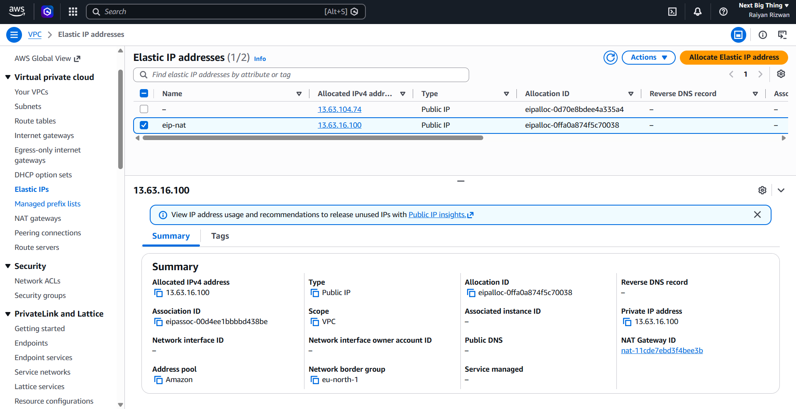

_Historical screenshot from before the replacement. It does not show the new association. Deletion of the original gateway and release of its address are not documented._

## Route tables

The public and private subnets have explicit associations with their respective named route tables.

| Route table | Destination   | Target                  | Purpose                          |
| ----------- | ------------- | ----------------------- | -------------------------------- |
| Public      | `10.0.0.0/16` | `local`                 | Traffic within the VPC           |
| Public      | `0.0.0.0/0`   | `igw-0800670e9261a05fc` | Internet traffic through the IGW |
| Private     | `10.0.0.0/16` | `local`                 | Traffic within the VPC           |
| Private     | `0.0.0.0/0`   | `nat-0cad1ae32b8356c55` | Outbound traffic through NAT     |

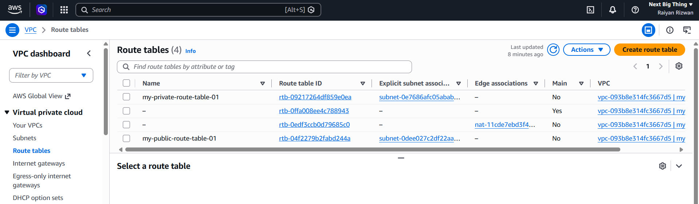

_Historical inventory from before the NAT replacement. It includes the main table and the Regional NAT edge-associated table. No subnet association does not mean a table is unused._

### Public routes and association

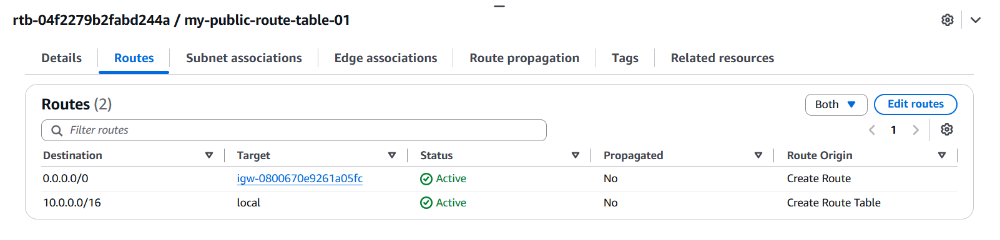

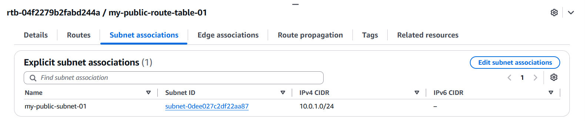

### Private routes and association

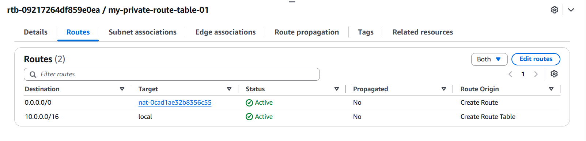

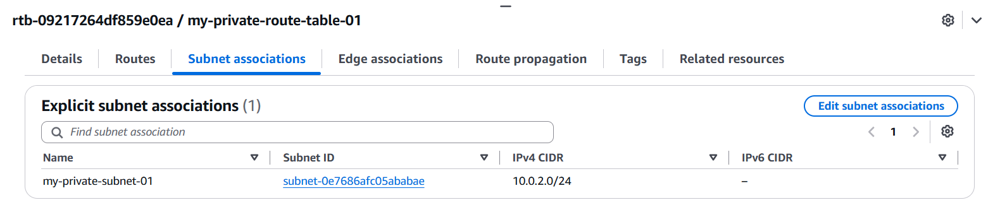

## Security groups

The rule editors show the following inbound configuration:

| Security group   | Protocol / port | Source                                   | Purpose                                      |
| ---------------- | --------------- | ---------------------------------------- | -------------------------------------------- |
| `public-ec2-sg`  | TCP 22 / SSH    | `2.49.155.241/32`                        | SSH from my public IP at capture time        |
| `public-ec2-sg`  | TCP 80 / HTTP   | `2.49.155.241/32`                        | Web access from my public IP at capture time |
| `private-ec2-sg` | TCP 22 / SSH    | `public-ec2-sg` (`sg-090c6b3089fc18c4f`) | SSH through the public instance              |

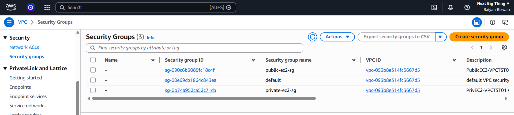

### Public instance rules

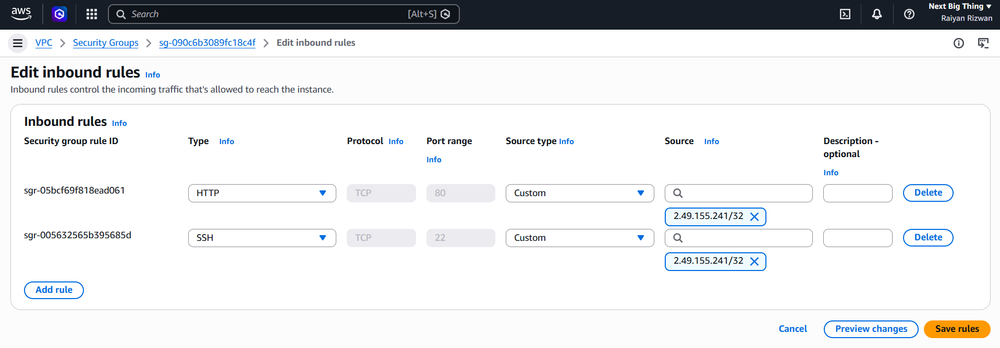

### Private instance rules

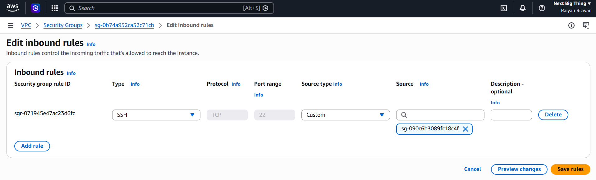

**What I learned:** Referencing the public security group permits matching traffic from network interfaces associated with that group. It does not copy that group's inbound rules. SSH to the private instance uses its private IP address.

## EC2 instances

Both instances are running `t3.micro` instances in `eu-north-1a`, with all displayed status checks passed.

### Public EC2 / SSH jump host

- **Instance ID:** `i-09f7fef78f39243b2`
- **Private IPv4:** `10.0.1.81`
- **Public IPv4:** `51.21.220.255`

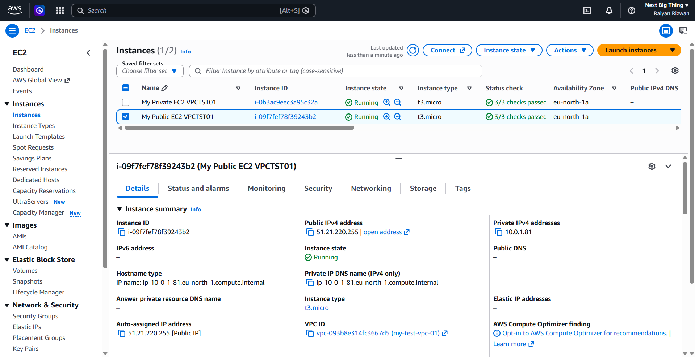

### Private EC2

- **Instance ID:** `i-0b3ac9eec3a95c32a`
- **Private IPv4:** `10.0.2.32`
- **Public IPv4:** None

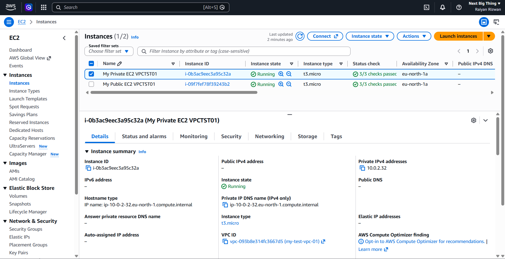

## Connectivity tests

### Test 1: HTTP access to the public instance

On the public Amazon Linux instance, I installed Apache and created a test page:

```bash
sudo dnf install -y httpd
echo "Assignment 1 - Public EC2 working" | sudo tee /var/www/html/index.html
sudo systemctl enable --now httpd
```

I opened `http://51.21.220.255` from my browser.

**Result:** The browser displayed `Assignment 1 - Public EC2 working`, demonstrating inbound HTTP access to the web server.

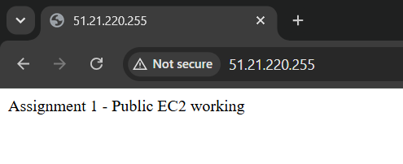

### Test 2: SSH to the private instance through the public instance

I ran this command from PowerShell on my computer, using a different key pair for each instance:

```powershell
ssh -i "C:\Users\raiyan.r\Downloads\PrivEC2-VPCTST01.pem" -o "ProxyCommand=ssh -i C:\Users\raiyan.r\Downloads\PublicEC2-VPCTST01.pem -W %h:%p ec2-user@51.21.220.255" ec2-user@10.0.2.32
```

| Command part               | Meaning                                                              |
| -------------------------- | -------------------------------------------------------------------- |
| Outer `-i`                 | Private instance's authentication key                                |
| `-i` inside `ProxyCommand` | Public instance's authentication key                                 |
| `-W %h:%p`                 | Forward through the public instance to the destination host and port |
| `%h`                       | Private instance address: `10.0.2.32`                                |
| `%p`                       | Destination SSH port: normally `22`                                  |

Both private key files remained on my computer.

**Result:** The terminal opened a session on `ip-10-0-2-32`, demonstrating access through the public instance.

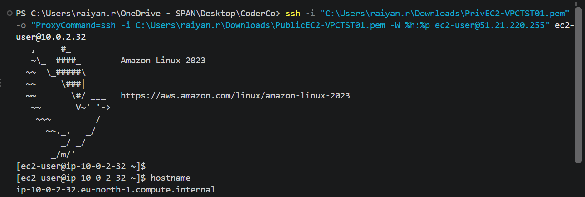

### Test 3: Outbound HTTPS from the private instance

Inside the private instance, I ran:

```bash
hostname
ip -4 addr
curl -I https://aws.amazon.com
```

**Result:** The hostname and interface address identify `10.0.2.32`, and the HTTPS request returned `HTTP/2 200`. This test was captured before the NAT replacement. It demonstrates the original outbound connectivity; a post-migration HTTPS test is not included. The new route screenshot separately confirms the replacement route is active.

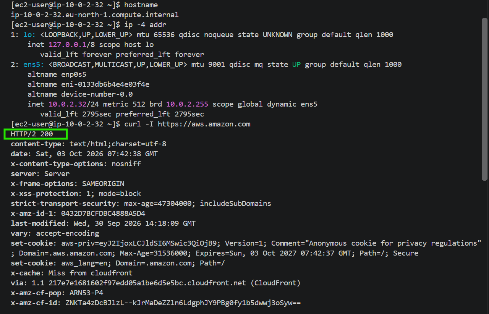

_The EC2 console screenshot proves the absence of a public IPv4 address. The operating system's interface output alone does not prove this._

## Troubleshooting and lessons learned

### Regional versus Zonal NAT

**Mistake:** I selected Regional availability mode initially. Outbound access worked, but this did not match the assignment's requirement to host NAT in the public subnet.

**Correction:** I created a Zonal NAT Gateway using the previously unused EIP (`13.63.104.74`) and changed the private default route to `nat-0cad1ae32b8356c55`. The updated route is active.

**Lesson:** Public connectivity type and availability mode are separate choices. Regional NAT operates at VPC level; public Zonal NAT resides in a public subnet. Successful connectivity alone does not establish that the deployment matches the requested architecture.

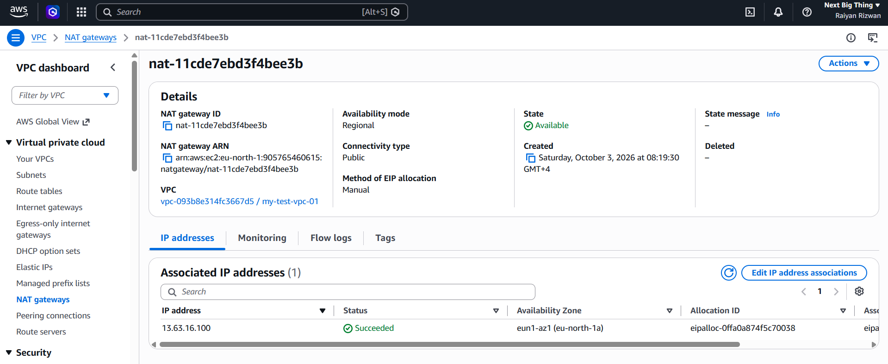

_Historical configuration, not the replacement gateway._

### EC2 Instance Connect and source IP

**Issue:** Browser-based EC2 Instance Connect failed when SSH was restricted to my public IP, but worked when I temporarily allowed all IPv4 addresses.

**Cause:** Browser-based Instance Connect sends SSH traffic from AWS's regional service, rather than directly from my computer's public IP. Local PowerShell SSH uses my network's public IP.

**Resolution:** I used local PowerShell SSH with my PEM keys and the documented public SG rule restricted to my public IP `/32`. The public EC2 then served as the bastion for private EC2 access. Allowing all IPs was a troubleshooting step, not the intended final configuration.

**Lesson:** Identify the actual connection source before choosing the SG rule. Browser access would need a separate rule for the regional Instance Connect prefix list. See [AWS Instance Connect prerequisites](https://docs.aws.amazon.com/AWSEC2/latest/UserGuide/ec2-instance-connect-prerequisites.html).

## References

- [AWS: Route-table routing options](https://docs.aws.amazon.com/vpc/latest/userguide/route-table-options.html) — local, Internet Gateway, and NAT routes.
- [AWS: Regional NAT gateways](https://docs.aws.amazon.com/vpc/latest/userguide/nat-gateways-regional.html) — how the captured mode differs from subnet-hosted NAT.
- [AWS: Manage EC2 detailed monitoring](https://docs.aws.amazon.com/AWSEC2/latest/UserGuide/manage-detailed-monitoring.html) — evidence for the monitoring bonus.
